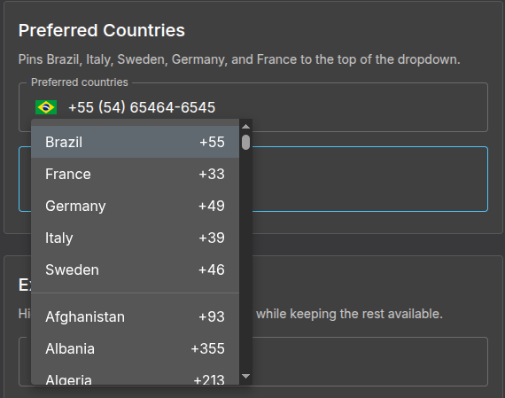

# @mmerlone/mui7-phone-number

A phone number input component for [MUI v7+](https://mui.com/) with auto-formatting, country selection, and full TypeScript support.

Built on top of `@mui/material/TextField`, rendering a country flag selector as a start adornment alongside the formatted phone input.

This is a fork of [mui-phone-number](https://github.com/alexplumb/material-ui-phone-number) updated to support MUI v7, React 19, and modern TypeScript.



## Requirements

- React 19+
- `@mui/material` v7+

## Installation

```sh
npm install @mmerlone/mui7-phone-number
# or
pnpm add @mmerlone/mui7-phone-number
```

## Usage

### Uncontrolled

```tsx
import MuiPhoneNumber from '@mmerlone/mui7-phone-number';

function MyForm() {
  return (
    <MuiPhoneNumber
      defaultCountry="us"
      onChange={(value, country) => {
        console.log(value);   // e.g. "+1 (702) 123-4567"
        console.log(country); // { name, dialCode, countryCode }
      }}
    />
  );
}
```

### Controlled

```tsx
import { useState } from 'react';
import MuiPhoneNumber from '@mmerlone/mui7-phone-number';

function MyForm() {
  const [phone, setPhone] = useState('');

  return (
    <MuiPhoneNumber
      defaultCountry="us"
      value={phone}
      onChange={(value) => setPhone(value)}
    />
  );
}
```

## Props

### Country selection

| Prop | Type | Default | Description |
|---|---|---|---|
| `defaultCountry` | `string` | `""` | Initial country (ISO 3166-1 alpha-2, e.g. `"us"`) |
| `onlyCountries` | `string[]` | — | Restrict to these country codes |
| `excludeCountries` | `string[]` | — | Exclude these country codes |
| `preferredCountries` | `string[]` | — | Pin these countries to the top of the dropdown |
| `regions` | `string \| string[]` | — | Filter by region or subregion (see [Regions](#regions)) |

### Input behaviour

| Prop | Type | Default | Description |
|---|---|---|---|
| `value` | `string` | — | Controlled value |
| `placeholder` | `string` | `"+1 (702) 123-4567"` | Input placeholder |
| `autoFormat` | `boolean` | `true` | Auto-format the number as the user types |
| `disableAreaCodes` | `boolean` | `false` | Disable area code sub-entries |
| `disableCountryCode` | `boolean` | `false` | Hide the dial code prefix in the input |
| `disableDropdown` | `boolean` | `false` | Render the flag without a clickable dropdown |
| `enableLongNumbers` | `boolean` | `false` | Allow numbers longer than the country format |
| `countryCodeEditable` | `boolean` | `true` | Allow the user to edit the country code portion |
| `localization` | `Record<string, string>` | — | Override country display names (e.g. `{ Germany: 'Deutschland' }`) |
| `native` | `boolean` | `false` | Use a native `<select>` for the country dropdown |

### Validation

| Prop | Type | Description |
|---|---|---|
| `error` | `boolean` | Force error state on the TextField |
| `isValid` | `(inputNumber: string) => boolean` | Custom validation — receives the raw digits. The field shows an error when this returns `false` |

### TextField passthrough

`MuiPhoneNumber` extends `TextFieldProps` (minus internally-managed keys), so standard MUI TextField props like `label`, `helperText`, `fullWidth`, `className`, `sx`, `size`, `color`, `name`, `id`, `required`, `variant`, `disabled`, and `placeholder` are forwarded automatically.

Additional phone-specific layout props:

| Prop | Type | Description |
|---|---|---|
| `dropdownClass` | `string` | Class name applied to the country dropdown container |
| `slotProps` | `{ input?, htmlInput? }` | MUI v7 `slotProps` forwarded to the TextField |
| `inputRef` | `Ref<HTMLInputElement>` | Ref forwarded to the underlying `<input>` element |

### Events

| Prop | Signature | Notes |
|---|---|---|
| `onChange` | `(value: string, country: CountryData) => void` | Fires on every input change |
| `onFocus` | `(event, country: CountryData) => void` | — |
| `onBlur` | `(event, country: CountryData) => void` | — |
| `onClick` | `(event, country: CountryData) => void` | — |

The `CountryData` object shape:

```ts
interface CountryData {
  name: string;
  dialCode: string;
  countryCode: string; // ISO 3166-1 alpha-2
}
```

## Exports

The package exports the default component and two useful types:

```ts
import MuiPhoneNumber from '@mmerlone/mui7-phone-number';
import type { PhoneNumberProps, CountryData } from '@mmerlone/mui7-phone-number';
```

## Regions

Pass a single string or an array to `regions` to restrict the country list.

**Regions:** `'america'` · `'europe'` · `'asia'` · `'oceania'` · `'africa'`

**Subregions:** `'north-america'` · `'south-america'` · `'central-america'` · `'caribbean'` · `'european-union'` · `'ex-ussr'` · `'middle-east'` · `'north-africa'`

```tsx
// Single region
<MuiPhoneNumber defaultCountry="it" regions="europe" />

// Multiple subregions
<MuiPhoneNumber defaultCountry="ca" regions={['north-america', 'caribbean']} />
```

## Localization

```tsx
<MuiPhoneNumber
  onlyCountries={['de', 'es']}
  localization={{ Germany: 'Deutschland', Spain: 'España' }}
/>
```

## Ref forwarding

The component forwards its `ref` to the MUI `TextField` root `<div>`. Use `inputRef` to access the underlying `<input>` element.

```tsx
const inputRef = useRef<HTMLInputElement>(null);

<MuiPhoneNumber defaultCountry="us" inputRef={inputRef} />
```

## License

MIT

Based on [material-ui-phone-number](https://github.com/alexplumb/material-ui-phone-number), [react-phone-input-2](https://github.com/bl00mber/react-phone-input-2), [react-phone-input](https://github.com/razagill/react-phone-input) and [mui-phone-number](https://github.com/phrensoua/mui-phone-number).
